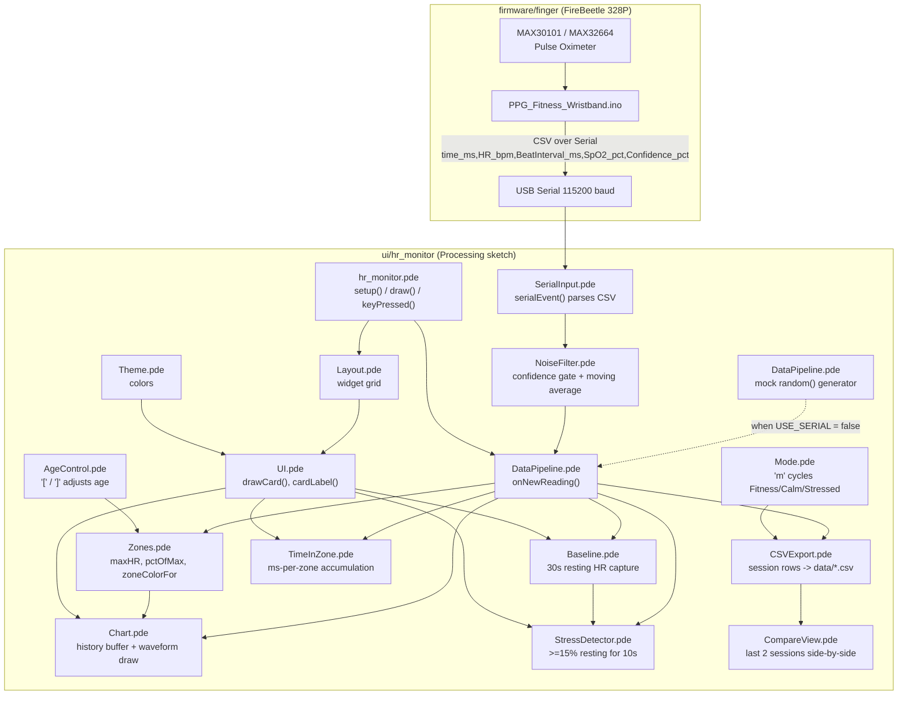

# Perfusion

## Architecture

```mermaid
flowchart TD
    subgraph Firmware["firmware/finger (FireBeetle 328P)"]
        Sensor["MAX30101 / MAX32664\nPulse Oximeter"] --> Ino["PPG_Fitness_Wristband.ino"]
        Ino -->|"CSV over Serial\ntime_ms,HR_bpm,BeatInterval_ms,SpO2_pct,Confidence_pct"| Serial["USB Serial 115200 baud"]
    end

    subgraph UI["ui/hr_monitor (Processing sketch)"]
        Serial --> SerialInput["SerialInput.pde\nserialEvent() parses CSV"]
        Mock["DataPipeline.pde\nmock random() generator"] -.->|"when USE_SERIAL = false"| Pipeline

        SerialInput --> NoiseFilter["NoiseFilter.pde\nconfidence gate + moving average"]
        NoiseFilter --> Pipeline["DataPipeline.pde\nonNewReading()"]

        Pipeline --> Chart["Chart.pde\nhistory buffer + waveform draw"]
        Pipeline --> Zones["Zones.pde\nmaxHR, pctOfMax, zoneColorFor"]
        Pipeline --> Baseline["Baseline.pde\n30s resting HR capture"]
        Pipeline --> TimeInZone["TimeInZone.pde\nms-per-zone accumulation"]
        Pipeline --> Stress["StressDetector.pde\n>=15% resting for 10s"]
        Pipeline --> CSVExport["CSVExport.pde\nsession rows -> data/*.csv"]

        Zones --> Chart
        Baseline --> Stress
        CSVExport --> Compare["CompareView.pde\nlast 2 sessions side-by-side"]

        Layout["Layout.pde\nwidget grid"] --> UIHelpers["UI.pde\ndrawCard(), cardLabel()"]
        Theme["Theme.pde\ncolors"] --> UIHelpers
        UIHelpers --> Chart
        UIHelpers --> Baseline
        UIHelpers --> Stress
        UIHelpers --> TimeInZone

        AgeControl["AgeControl.pde\n'[' / ']' adjusts age"] --> Zones
        Mode["Mode.pde\n'm' cycles Fitness/Calm/Stressed"] --> CSVExport

        Main["hr_monitor.pde\nsetup() / draw() / keyPressed()"] --> Pipeline
        Main --> Layout
    end
```
