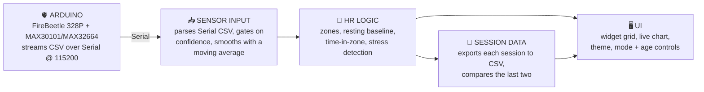

# Perfusion

## Architecture

```mermaid
flowchart LR
    ARDUINO["🫀 ARDUINO\nFireBeetle 328P + MAX30101/MAX32664\nstreams CSV over Serial @ 115200"]

    INPUT["📥 SENSOR INPUT\nparses Serial CSV, gates on\nconfidence, smooths with a\nmoving average"]

    LOGIC["🧠 HR LOGIC\nzones, resting baseline,\ntime-in-zone, stress detection"]

    UI["🖥️ UI\nwidget grid, live chart,\ntheme, mode + age controls"]

    DATA["💾 SESSION DATA\nexports each session to CSV,\ncompares the last two"]

    ARDUINO -->|"Serial"| INPUT --> LOGIC --> UI
    LOGIC --> DATA --> UI
```
